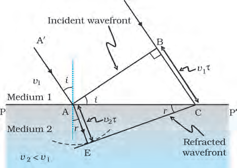
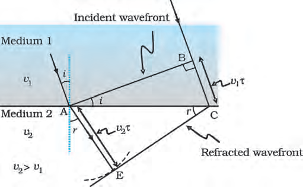
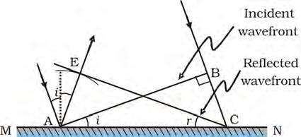
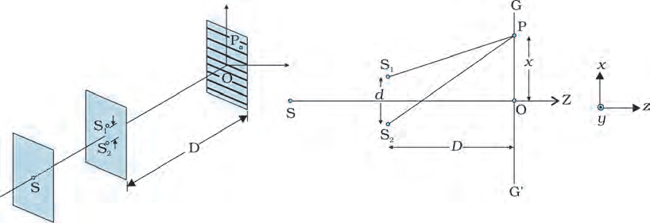

# NCERT Class 12 - 10 - Wave Optics
Extracted figures from **leph1210.pdf**

**Fig. 10.2**  (page 3)
F1F2 represents the spherical wavefront (with O as centre) at t = 0. The envelope of the secondary wavelets emanating from F1F2 produces the forward moving wavefront G1G2. The backwave D1D2 does not exist.

**Fig. 10.4 A**  (page 4)
plane wave AB is incident at an angle i on the surface PP¢ separating medium 1 and medium 2. The plane wave undergoes refraction and CE represents the refracted wavefront. The figure corresponds to v2 < v1 so that the refracted waves bends towards the normal. Reprint 2025-26

**Fig. 10.5**  (page 6)
Refraction of a plane wave incident on a rarer medium for which v2 > v1. The plane wave bends away from the normal.

**Fig. 10.6**  (page 6)
. Let CE represent the tangent plane drawn from the point C to this sphere. Obviously AE = BC = vt Reprint 2025-26

**Fig. 10.6**  (page 7)
Reflection of a plane wave AB by the reflecting surface MN. AB and CE represent incident and reflected wavefronts.

**Fig. 10.7**  (page 7)
Refraction of a plane wave by (a) a thin prism, (b) a convex lens. (c) Reflection of a plane wave by a concave mirror. If we now consider the triangles EAC and BAC we will find that they are congruent and therefore, the angles i and r (as shown in Fig. 10.6) would be equal. This is the law of reflection. Once we have the laws of reflection and refraction, the behaviour of prisms, lenses, and mirrors can be understood. These phenomena were discussed in detail in Chapter 9 on the basis of rectilinear propagation of light. Here we just describe the behaviour of the wavefronts as they undergo reflection or refraction. In Fig. 10.7(a) we consider a plane wave passing through a thin prism. Clearly, since the speed of light waves is less in glass, the lower portion of the incoming wavefront (which travels through the greatest thickness of glass) will get delayed resulting in a tilt in the emerging wavefront as shown in the figure. In Fig. 10.7(b) we consider a plane wave incident on a thin convex lens; the central part of the incident plane wave traverses the thickest portion of the lens and is delayed the most. The emerging wavefront has a depression at the centre and therefore the wavefront becomes spherical and converges to the point F which is known as the focus. In Fig. 10.7(c) a plane wave is incident on a concave mirror and on reflection we have a spherical wave converging to the focal point F. In a similar manner, we can understand refraction and reflection by concave lenses and convex mirrors. From the above discussion it follows that the total time taken from a point on the object to the corresponding point on the image is the same measured along any ray. For example, when a convex lens focusses light to form a real image, although the ray going through the centre traverses a shorter path, but because of the slower speed in glass, the time taken is the same as for rays travelling near the edge of the lens. Reprint 2025-26

**Fig. 10.10**  (page 9)
Locus of points for which S1P – S2P is equal to zero, ±l, ± 2l, ± 3l. Reprint 2025-26

**Fig. 10.12**  (page 11)
Young’s arrangement to produce interference pattern.

**Fig. 10.13**  (page 12)
Computer generated fringe pattern produced by two point source S1 and S2 on the screen GG¢ (Fig. 10.12); d = 0.025 mm, D = 5 cm and l = 5 × 10–5 cm.) (Adopted from OPTICS by A. Ghatak, Tata McGraw Hill Publishing Co. Ltd., New Delhi, 2000.) Thomas Young (1773 – 1829) English physicist, physician and Egyptologist. Young worked on a wide variety of scientific problems, ranging from the structure of the eye and the mechanism of vision to the decipherment of the Rosetta stone. He revived the wave theory of light and recognised that interference phenomena provide proof of the wave properties of light. THOMAS YOUNG (1773 – 1829) We will have constructive interference resulting in a bright region when xd D = nl. That is, x = xn = n D d λ ; n = 0, ± 1, ± 2, ... (10.13) On the other hand, we will have destructive interference resulting in a dark region when xd D = (n+ 1 2 ) l that is x = xn = (n+ 1 2 ) ; 0, 1, 2 D n d     (10.14) Thus dark and bright bands appear on the screen, as shown in Fig. 10.13. Such bands are called fringes. Equations (10.13) and (10.14) show that dark and bright fringes are equally spaced.

**Fig. 10.15**  (page 13)
Intensity distribution and photograph of fringes due to diffraction at single slit. Reprint 2025-26

